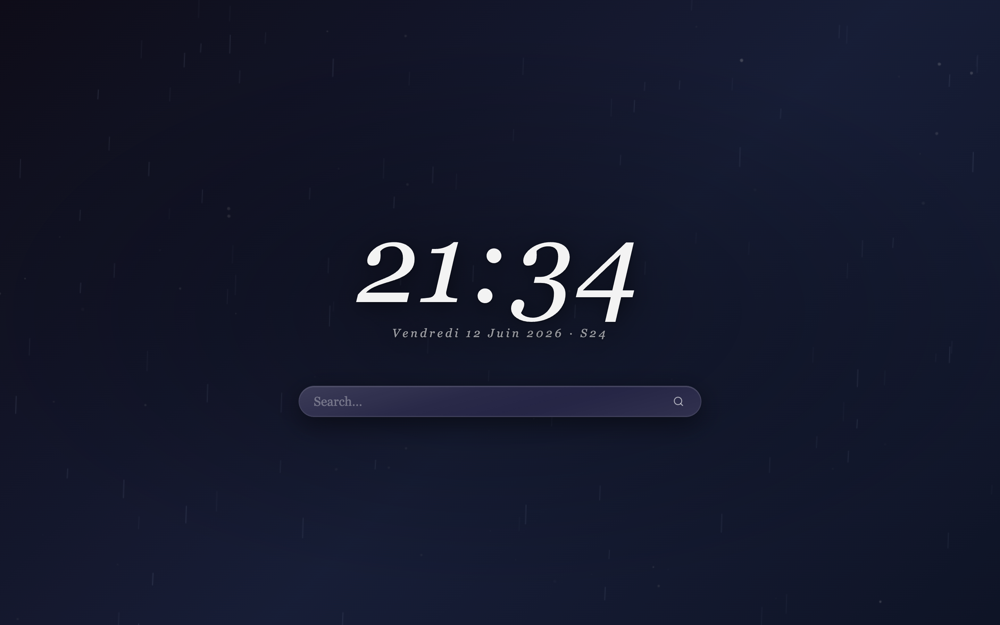
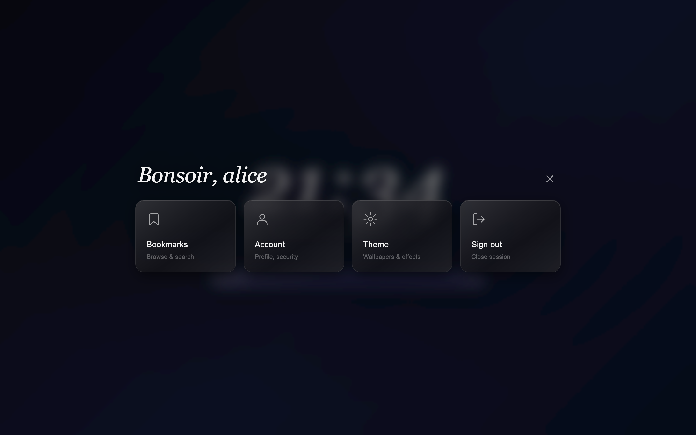
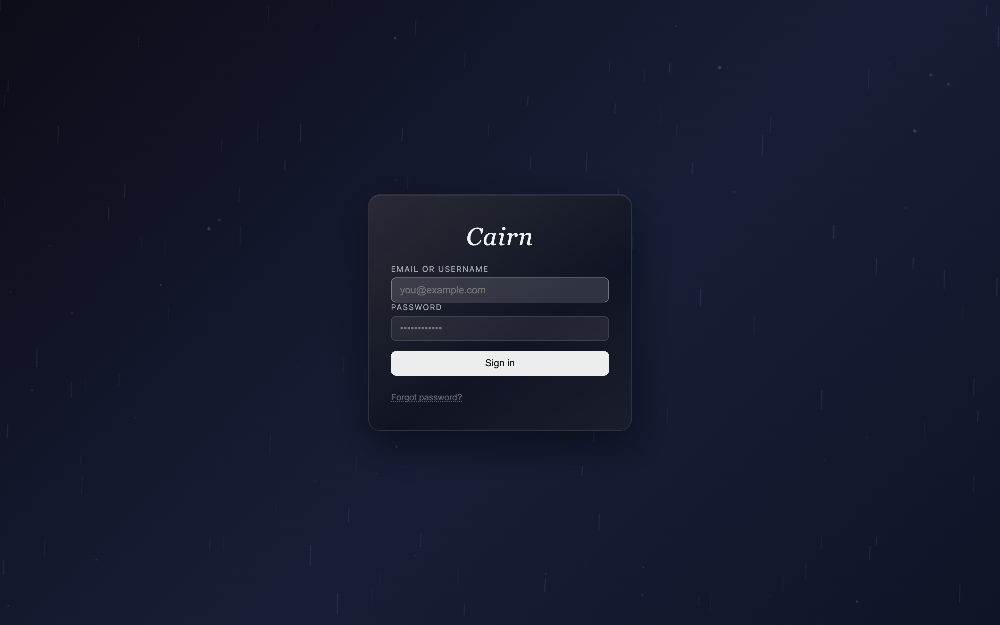

# Cairn

A self-hosted personal start page — new-tab replacement for your browser.  
Clock, ambient effects, wallpapers, configurable search, bookmarks, multi-user with admin panel.

> **No cloud. No tracking. Runs entirely on your own machine or server.**

This project is **100% vibecoded** — designed and built in conversation with AI (Claude Code), iterated feature by feature on a homelab. Craftsmanship for the joy of it, not for scale.

---

## What it looks like

*The home — clock, search, your wallpaper (image or video), rain effect:*



*The hub (`!menu` in the search bar) — liquid-glass tiles over your background:*



*The login:*



Type `!bm` in the search bar to open the bookmark manager.  
Type `!menu` (or your configured bang) for the full-screen hub.

---

## Features

| Feature | Details |
|---|---|
| **Clock & date** | Large italic clock, ISO week number |
| **Wallpapers** | Images & videos, pin favorite, random rotation, adaptive light/dark theme via luminance sampling |
| **Ambient effects** | Rain and dust canvas animations (opt-in per-user) |
| **Search** | DuckDuckGo by default — Google, Brave, Bing, Kagi, or custom URL |
| **Bangs** | `!bm` bookmarks, `!g` Google, `!yt` YouTube, `!gh` GitHub, `!hub` full menu, + all DDG bangs |
| **Bookmarks** | Folders, tags, import/export Netscape format (Chrome/Firefox/Safari/Edge), mobile bookmarklet |
| **TOTP / 2FA** | Optional, RFC 6238, works with any authenticator app |
| **Multi-user** | First account created becomes admin automatically |
| **Invitations** | Admin sends invite links; open registration toggle |
| **SSO / OIDC** | OpenID Connect (Authentik, Keycloak, Authelia, Google…) — JIT account provisioning |
| **Admin panel** | User management, storage quotas, upload limits, audit log, pending registrations |
| **Email** | Account setup emails, SMTP configurable via env or admin UI |

---

## Requirements

- **Docker** and **Docker Compose** — that's it.  
  Go does not need to be installed on your machine; everything builds inside Docker.

---

## Quick start (5 minutes)

### Step 1 — Clone the repo

```bash
git clone https://github.com/darktweek/cairn-dev.git
cd cairn
```

### Step 2 — Create your `.env` file

```bash
cp .env.example .env
```

Open `.env` and fill in the required values:

```bash
# Generate a random secret:  openssl rand -base64 32
CAIRN_SESSION_SECRET=your-random-secret-here

# SMTP credentials (needed to send invitation/setup emails)
CAIRN_SMTP_USER=you@example.com
CAIRN_SMTP_PASS=your-smtp-password
```

> **No SMTP?** You can skip SMTP for a first test — just know that invitation emails won't send.  
> Set `CAIRN_SMTP_HOST` to a dummy value and create users manually via the admin panel.

### Step 3 — Edit `compose.yaml`

Open `compose.yaml` and update these three lines to match your setup:

```yaml
CAIRN_BASE_URL:  "http://localhost:8080"   # or your public URL if self-hosting
CAIRN_SMTP_HOST: "smtp.example.com"
CAIRN_SMTP_FROM: "cairn@example.com"
```

For local testing, `http://localhost:8080` is fine.

### Step 4 — Build & start

There is no published Docker image (yet) — the image is **built locally from this repo**, automatically:

```bash
# One-time: the default compose file expects this network (used for Traefik).
# Create it even if you don't use Traefik, or remove the networks/labels
# sections from compose.yaml.
docker network create traefik_proxy

docker compose up -d --build
```

The first run downloads the Go builder image and compiles everything (~2 minutes). Subsequent starts are instant.

### Step 5 — Open in your browser

Go to [http://localhost:8080](http://localhost:8080) and click **Sign in**.  
**The very first account created automatically becomes admin.**

That's it — you're running Cairn.

---

## Set it as your new-tab page

### Chrome / Edge / Brave
Install the [New Tab Redirect](https://chrome.google.com/webstore/detail/new-tab-redirect/icpgjfneehieebagbmdbhnlpiopdcmna) extension and point it to `http://localhost:8080`.

### Firefox
Use [New Tab Homepage](https://addons.mozilla.org/en-US/firefox/addon/new-tab-homepage/) or set it in `about:preferences` under Home.

### Safari
Settings → General → New tabs open with → Homepage → set your URL.

---

## Configuration reference

All configuration is via environment variables.  
Sensitive values go in `.env` (already gitignored).

### Core

| Variable | Default | Required | Description |
|---|---|---|---|
| `CAIRN_ADDR` | `:8080` | no | Listen address |
| `CAIRN_ENV` | `production` | no | `production` or `development` |
| `CAIRN_BASE_URL` | — | **yes** | Your public URL, e.g. `https://start.example.com` |
| `CAIRN_DB_PATH` | `/data/db.sqlite` | no | SQLite database path |
| `CAIRN_MEDIA_PATH` | `/data/media` | no | Wallpaper storage directory |
| `CAIRN_SESSION_SECRET` | — | **yes** | HMAC key, minimum 32 characters |

### Uploads & storage

| Variable | Default | Description |
|---|---|---|
| `CAIRN_DEFAULT_WALLPAPER_LIMIT` | `10` | Max wallpapers per user |
| `CAIRN_MAX_UPLOAD_SIZE` | `52428800` | Max single file size in bytes (50 MB) |
| `CAIRN_STORAGE_QUOTA` | `209715200` | Max total media per user in bytes (200 MB) |

Per-user overrides for both limits are available in the admin panel.

### SMTP (email)

| Variable | Default | Required | Description |
|---|---|---|---|
| `CAIRN_SMTP_HOST` | — | **yes** | SMTP server hostname |
| `CAIRN_SMTP_PORT` | `587` | no | SMTP port |
| `CAIRN_SMTP_USER` | — | **yes** | SMTP username |
| `CAIRN_SMTP_PASS` | — | **yes** | SMTP password |
| `CAIRN_SMTP_FROM` | — | **yes** | Sender address |
| `CAIRN_SMTP_TLS` | `true` | no | Enable STARTTLS |

SMTP can also be configured entirely from the admin UI if not set via environment.

### SSO / OpenID Connect (optional)

| Variable | Default | Description |
|---|---|---|
| `CAIRN_OIDC_ISSUER` | — | OIDC issuer URL. If set, locks SSO config (otherwise editable in admin) |
| `CAIRN_OIDC_CLIENT_ID` | — | OIDC client ID |
| `CAIRN_OIDC_CLIENT_SECRET` | — | OIDC client secret (put in `.env`) |
| `CAIRN_OIDC_PROVIDER_NAME` | `SSO` | Label shown on the "Sign in with …" button |
| `CAIRN_OIDC_SCOPES` | `openid profile email` | Requested scopes |

**Redirect URI to register with your provider:**
```
<CAIRN_BASE_URL>/api/auth/sso/callback
```

### Misc

| Variable | Default | Description |
|---|---|---|
| `CAIRN_TRUSTED_PROXY` | `true` | Read real IP from `CF-Connecting-IP` / `X-Forwarded-For` |
| `CAIRN_MENU_BANG` | — | Bang that opens the full-screen menu (default `!menu`, editable in admin if not set here) |
| `CAIRN_TOTP_ISSUER` | `Cairn` | Name shown in your authenticator app |
| `CAIRN_BOOKMARKLET_TOKEN_LIFETIME` | `90` | Bookmarklet token lifetime in days |

---

## Behind a reverse proxy

### Traefik + Cloudflare Tunnel

`compose.yaml` includes Traefik labels ready to use. Update `Host(...)` to your domain:

```yaml
labels:
  traefik.enable: "true"
  traefik.http.routers.cairn.rule: "Host(`start.example.com`)"
  traefik.http.routers.cairn.entrypoints: "websecure"
  traefik.http.routers.cairn.tls.certresolver: "cloudflare"
```

Set `CAIRN_TRUSTED_PROXY=true` so client IPs are read correctly from `CF-Connecting-IP`.

### Nginx

```nginx
location / {
    proxy_pass         http://127.0.0.1:8080;
    proxy_set_header   Host              $host;
    proxy_set_header   X-Forwarded-For   $remote_addr;
}
```

---

## Wallpapers

**Accepted formats:**

| Type | Extensions |
|---|---|
| Image | `.jpg` `.jpeg` `.png` `.webp` `.avif` |
| Video | `.mp4` `.webm` |

**Adaptive theme:** Cairn samples the luminance of your active wallpaper and automatically switches between light and dark text for readability.

**Single pin:** Only one wallpaper can be pinned as favorite at a time. Pinning a new one automatically unpins the previous.

---

## Bookmarklet

Save any page in one click from any browser, including mobile Safari:

1. Go to **Account → Bookmarklet → Generate bookmarklet**
2. Drag the link to your browser's bookmarks bar
3. Click it on any page to save it to Cairn

---

## Registrations & invitations

By default, registration is **invite-only**. The admin sends an invite link by email.  
Open registration (anyone can request an account) can be toggled in **Admin → Settings → Registration**.

When open registration is enabled, users submit their email and the admin approves or revokes pending requests from **Admin → Invitations**.

---

## Making changes

You don't need Go installed on your machine — everything compiles inside Docker.

The workflow is simple: edit the code, then rebuild and restart the container:

```bash
docker compose up -d --build
```

That's it. The `--build` flag recompiles the app with your changes before restarting it.

**Tip:** set `CAIRN_ENV: "development"` in `compose.yaml` to get human-readable text logs instead of JSON.

---

## Project structure

```
cairn/
├── cmd/cairn/          — entrypoint (main.go, router, graceful shutdown)
├── internal/
│   ├── config/         — config loading and validation
│   ├── db/             — SQLite setup + embedded goose migrations
│   ├── model/          — data structs
│   ├── repository/     — database access (interfaces + SQLite implementations)
│   ├── service/        — business logic (auth, bookmarks, wallpapers, admin…)
│   ├── handler/        — HTTP JSON handlers
│   └── middleware/     — auth, admin, rate limit, CORS, headers, bookmarklet
├── web/static/
│   ├── index.html      — HTML shell
│   ├── style.css       — styles (CSS variables, adaptive theme)
│   └── app.js          — vanilla JS SPA (zero dependencies)
├── .env.example        — environment variable template
├── Dockerfile          — multi-stage build → ~5 MB scratch image
└── compose.yaml        — production deployment with Traefik labels
```

---

## Security

| Area | Implementation |
|---|---|
| Passwords | Argon2id (time=1, memory=64 MB, threads=4) |
| Sessions | SHA-256 hashed tokens, `HttpOnly` + `Secure` + `SameSite=Strict` cookies |
| TOTP | RFC 6238, secrets encrypted AES-256-GCM at rest |
| Rate limiting | Sliding window per hashed IP, in-memory |
| User isolation | `userID` checked on every repository call; media served behind auth |
| Uploads | Magic bytes validated, server-generated filenames |
| Container | `scratch` base, read-only FS, `no-new-privileges`, `CAP_DROP ALL` |
| HTTP headers | CSP, `X-Frame-Options: DENY`, `Referrer-Policy`, `Permissions-Policy` |

---

## Tech stack

| Component | Choice |
|---|---|
| Language | Go 1.26 |
| Router | chi v5 |
| Database | SQLite (WAL mode) |
| SQLite driver | modernc.org/sqlite (pure Go, zero CGO) |
| Migrations | goose (embedded) |
| Docker image | `scratch` (~5 MB) |
| Frontend | Vanilla JS, zero dependencies |

---

## License

MIT
